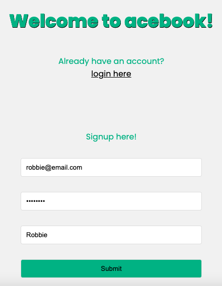
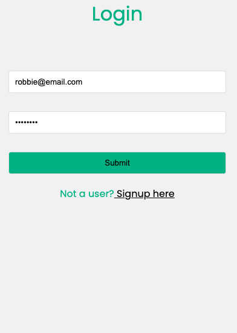
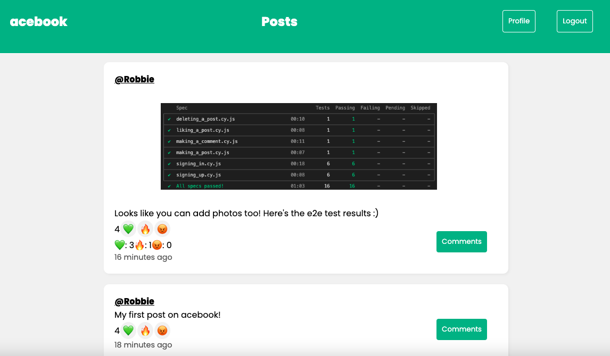

# Acebook

In this project, our seven person group was tasked with working on an existing application. We were required to familiarise ourselves with the codebase we inherited, made with technologies that most of us had no previous experience in. After we had done this we worked to **improve and extend** it with features of our choosing.

## Contents

[Screenshots](#Screenshots)

[Video runthrough](#Video-runthrough)

[Technologies](#Technologies)

[Trying the project](#Trying-the-project)

## Screenshots

<table>
  <tr>
    <td>Sign up form</td>
     <td>Login page</td>
     <td>Feed</td>
  </tr>
  <tr>
    <td></td>
    <td></td>
    <td></td>
  </tr>
 </table>

## Video runthrough

https://user-images.githubusercontent.com/113419992/219073395-5846e59c-eae8-44f2-b978-70d2548f2d51.mp4

## Technologies

Here's an overview of the technologies used to build the application.

- **M** - MongoDB
- **E** - Express
- **R** - React
- **N** - Node

We used CSS for styling, and the following for other aspects of the code:

- [JSON Web Tokens](https://jwt.io/) for authentication.
- [Jest](https://jestjs.io/) for unit testing on the back-end.
- [Cypress](https://www.cypress.io/) for end-to-end testing and component testing, on the front-end.
- [Mongoose](https://mongoosejs.com) to model objects in MongoDB.
- [Prettier](https://prettier.io) for code formatting.
- [ESLint](https://eslint.org) for linting.
- [Nodemon](https://nodemon.io/) to reload the server automatically.
- [PostMan](https://www.postman.com) for testing http requests.

### Architecture

The application is comprised of two distinct pieces.

- A backend API built with Express
- A front end built with React

The React front end sends HTTP requests to the backend API.


## Trying the project

### Setup

1. Clone this repository
2. Install Node.js dependencies for both frontend and backend directories
```
; cd api
; npm install
; cd ../frontend
; npm install
```
3. Install MongoDB
```
brew tap mongodb/brew
brew install mongodb-community@5.0
```
4. Start MongoDB
```
brew services start mongodb-community@5.0
```

### Running the project

1. Start the server in one terminal

```
; cd api
; JWT_SECRET=SUPER_SECRET npm start
```

2. Start the front end in another terminal

```
; cd frontend
; npm start
```

You should now be able to open your browser and go to `http://localhost:3000/signup` to create a new user.

### Testing

#### The Backend

1. Start the server in test mode

```
; cd api
; JWT_SECRET=SUPER_SECRET npm run start:test
```

2. Then run the tests in a new terminal session

```
; cd api
; JWT_SECRET=SUPER_SECRET npm run test
```

#### The frontend

1. Follow step 1 as for the backend. Then start the front end in a new terminal session

```
; cd frontend
; JWT_SECRET=SUPER_SECRET npm start
```

2. Run the tests in a new terminal session

```
; cd frontend
; JWT_SECRET=SUPER_SECRET npm run test
```
